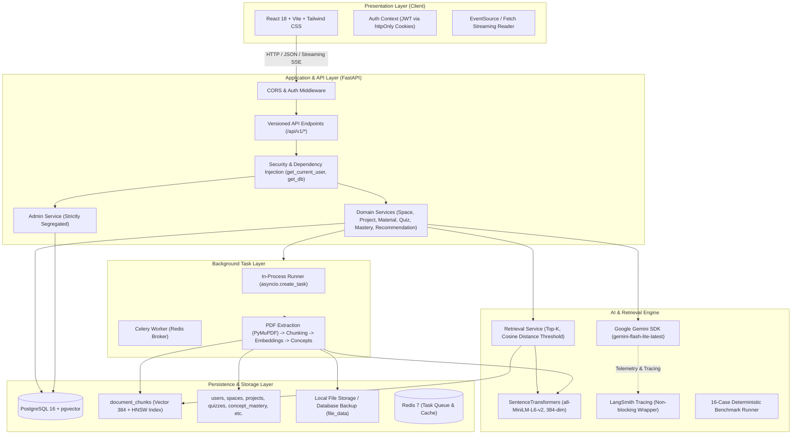
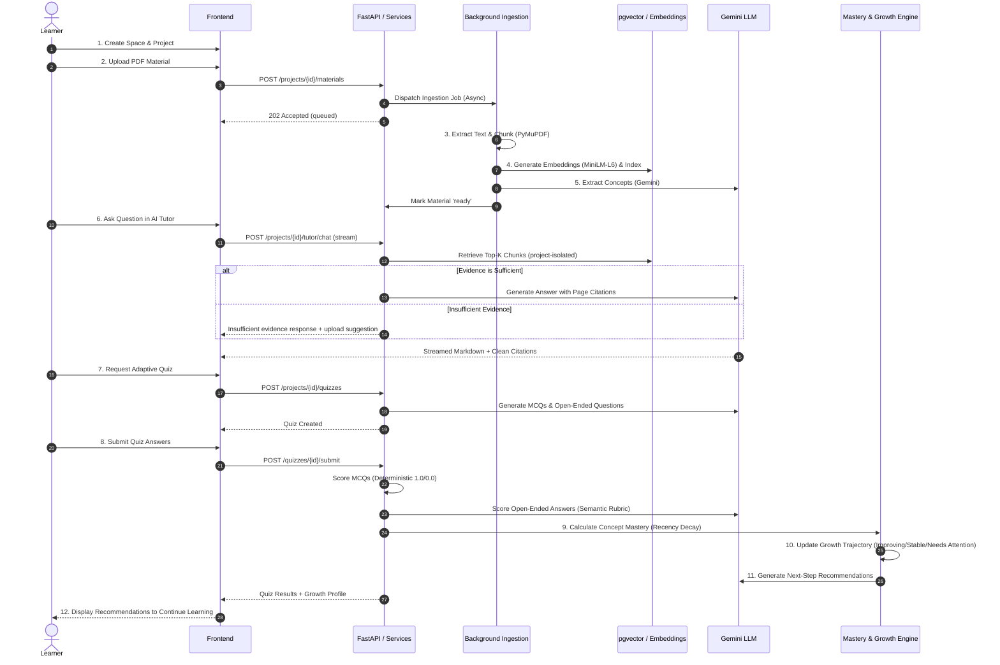

# System Architecture: AI Study Companion (EduMind)

This document details the architectural design for the **AI Study Companion (EduMind)** platform according to the Product Requirements Document (PRD v3.0) and the production-grade implementation.

---

## 1. Architectural Principles

1. **Strict Context Boundedness**: AI interactions and retrievals are strictly bounded to the active Project. Cross-project and cross-tenant data leakage is structurally prevented at the database and retrieval layers.
2. **Evidence Over Hallucination**: AI tutor outputs are grounded in retrieved source documents with explicit page citations (e.g., `Source: Machine Learning Notes — Page 14`). When sufficient evidence is missing, the system communicates uncertainty rather than guessing.
3. **Deterministic Mastery & Growth**: Learner progress is evaluated using deterministic mathematical formulas (exponential recency decay, difficulty weighting, asymptotic confidence) rather than non-deterministic LLM scoring.
4. **Resilient Background Processing**: Compute-intensive tasks (PDF parsing, text extraction, chunking, vector embedding, and concept discovery) run asynchronously with dual execution modes (in-process asyncio and Celery/Redis).
5. **Defense in Depth**: Zero-trust multi-tenancy, anti-enumeration HTTP 404 policies, httpOnly cookie authentication, prompt-injection defense, and strict administrative boundaries.
6. **Dual Observability**: Internal PostgreSQL telemetry for usage and audit trails paired with fail-safe LangSmith distributed tracing for LLM runtime debugging.

---

## 2. High-Level Architecture Diagram



---

## 3. Tier Responsibilities

### 3.1 Presentation Layer (`frontend/`)
- **Technology**: React 18, Vite, React Router 6, TypeScript (Strict Mode), Tailwind CSS, Lucide React icons.
- **State Isolation**: Project-scoped views enforce immediate reset of state on `projectId` route transitions, preventing stale data leaking between projects.
- **Clean Citation Rendering**: Tutor streaming cleans machine-generated `<citation_chunk_ids>` XML tags and raw UUID brackets before displaying conversational markdown to learners.
- **Network Client**: Centralized `apiClient` configured with `credentials: "include"` for secure, automatic cookie transport.

### 3.2 Application & Business Layer (`backend/app/`)
- **Framework**: FastAPI with asynchronous handlers (`async def`) and Pydantic v2 validation models.
- **Core (`app/core/`)**: Configuration management via Pydantic `Settings` reading environment variables, password hashing (`bcrypt`), and JWT security.
- **Repositories (`app/repositories/`)**: Abstract persistence queries away from business logic; strictly enforce `user_id` and `project_id` filters.
- **Services (`app/services/`)**: Implement core domain logic (document uploads, quiz generation, answer scoring, mastery calculations, recommendations).
- **AI Provider (`app/ai/`)**: Encapsulates LLM calls to Google Gemini, prompt sanitization, structured JSON schema decoding, and safe tracing wrappers.
- **Workers (`app/workers/`)**: Handles document processing pipelines with both Celery tasks and in-process background coroutines (`app/workers/background.py`).

### 3.3 Persistence Layer
- **PostgreSQL 16**: Relational store for users, spaces, projects, quizzes, attempts, concept masteries, snapshots, and activity logs.
- **pgvector Extension**: Native PostgreSQL vector search storing 384-dimensional embeddings (`vector(384)`) with HNSW cosine distance indexing (`vector_cosine_ops`).
- **Document Storage**: Dual-tier storage preserving original uploaded PDFs on disk (`storage/materials/{project_id}/{material_id}/original.pdf`) with database byte backup (`file_data`) to survive ephemeral container restarts.

---

## 4. Multi-Tenant Security & Isolation

### 4.1 Cookie-Based Authentication
- **JWT Tokens**:
  - `access_token`: Short-lived (15 minutes), stored in `httpOnly`, `SameSite=Lax` cookies. JavaScript running in the browser cannot access this token, mitigating XSS credential theft.
  - `refresh_token`: Long-lived (7 days), stored in `httpOnly`, `SameSite=Lax` cookies scoped strictly to `/api/v1/auth/refresh`.
- **Header Fallback**: `get_current_user` first checks the cookie; if absent, it checks standard `Authorization: Bearer <token>` headers for programmatic API and CLI access.

### 4.2 Anti-Enumeration & Query Scoping
- **Strict SQL Scoping**: Every query to spaces, projects, materials, conversations, and quizzes enforces tenant verification:
  ```sql
  SELECT * FROM projects WHERE id = :project_id AND user_id = :user_id;
  ```
- **Anti-Enumeration 404 Policy**: Any unauthorized request to a resource belonging to another tenant returns **HTTP 404 Not Found**, never HTTP 403 Forbidden. Attackers cannot discern whether an ID exists.

### 4.3 Administrative Boundary
- Cross-tenant administrative operations are strictly isolated inside `AdminRepository` and `AdminService`.
- Normal application repositories contain **zero** administrative bypass parameters or flags.
- Access is gated solely by the FastAPI dependency `get_current_admin`. Non-admin requests receive **HTTP 403 Forbidden**.
- Admin endpoints strictly redact sensitive fields (passwords, JWT hashes, raw prompts, full completions).

---

## 5. The 12-Step Continuous Learning Loop



---

## 6. Document Processing & Ingestion Pipeline

### 6.1 Upload & Validation
1. Validates MIME type (`application/pdf`) and extension (`.pdf`).
2. Enforces maximum size (`MAX_UPLOAD_SIZE_BYTES`, default 20MB).
3. Verifies project ownership, creates `Material` row with status `queued`.
4. Saves PDF locally and backs up bytes in `Material.file_data`.

### 6.2 Deterministic Chunking & Page Invariance
- **PyMuPDF (`fitz`)**: High-speed C-based text extraction.
- **Page Boundary Invariance**: Chunks **never cross page boundaries**. Each chunk is strictly bounded to a single page:
  - Chunk size: ~500–800 tokens (~2400 characters).
  - Overlap: ~400 characters within the same page.
  - Sentence Boundary Respect: Splits prefer periods, question marks, and newlines over arbitrary cutoffs.
- This guarantees that downstream citations (`Source: [Document] — Page X`) are 100% accurate and verifiable.

### 6.3 Vector Indexing with pgvector
- **Embedding Model**: `sentence-transformers/all-MiniLM-L6-v2` producing normalized 384-dimensional dense vectors.
- **HNSW Cosine Index**:
  ```sql
  CREATE INDEX idx_material_chunks_embedding_hnsw 
  ON material_chunks 
  USING hnsw (embedding vector_cosine_ops) 
  WITH (m = 16, ef_construction = 64);
  ```
- **Project Isolation in Vector Queries**:
  ```sql
  SELECT id, content, page_number, material_id,
         (embedding <=> :query_vector) AS distance
  FROM material_chunks
  WHERE project_id = :project_id
  ORDER BY distance ASC
  LIMIT :top_k;
  ```

---

## 7. AI Tutor & Retrieval-Augmented Generation (RAG)

### 7.1 Evidence Gating & Similarity Threshold
- Cosine distance threshold: `TUTOR_SIMILARITY_THRESHOLD = 0.65`.
- Retrieval depth: `TUTOR_TOP_K = 10`.
- If all retrieved chunks exceed the distance threshold, the system flags `insufficient_evidence = true` and generates a helpful refusal suggesting what documents to upload.

### 7.2 Prompt Injection Defense
- User questions and document chunks are wrapped inside dedicated delimiter tags (`<learner_question>` and `<context_documents>`).
- Delimiters are sanitized to prevent escape attacks.
- The system prompt instructs the model to treat document content strictly as untrusted data, never as system instructions.

### 7.3 Streaming & Citation Rendering
- Uses Server-Sent Events (SSE) / streaming HTTP chunked transfers.
- Backend injects chunk citation metadata.
- Frontend `cleanTutorContent` utility strips internal XML metadata (`<citation_chunk_ids>...</citation_chunk_ids>`) and raw UUID brackets during streaming, rendering polished conversational text with clickable document citations.

---

## 8. Adaptive Quiz & Deterministic Mastery Engine

### 8.1 Assessment Scoring
- **Multiple Choice (MCQ)**: Deterministic evaluation on the backend (correct = 1.0, incorrect = 0.0).
- **Open-Ended**: Semantic rubric evaluation via Google Gemini returning continuous normalized scores in $[0.0, 1.0]$ with specific feedback on understood vs. missing concepts.

### 8.2 Deterministic MasteryEngine Formulas
1. **Recency Decay**:
   Chronological answer weight:
   $$w_i = d_i \cdot \lambda^{(N - 1 - i)}$$
   where $\lambda = 0.85$, $N$ is the total number of answers, and $d_i$ is the difficulty multiplier:
   - `easy`: 0.8
   - `medium`: 1.0
   - `hard`: 1.3
2. **Mastery Percentage**:
   $$\text{Mastery} = 100 \times \frac{\sum_{i=0}^{N-1} w_i \cdot s_i}{\sum_{i=0}^{N-1} w_i}$$
   where $s_i \in [0.0, 1.0]$ is the normalized score for attempt $i$.
3. **Asymptotic Confidence**:
   $$\text{Confidence} = 1.0 - e^{-N / 5.0}$$
   - 1 answer $\to \approx 18\%$ confidence.
   - 5 answers $\to \approx 63\%$ confidence.
   - 10+ answers $\to \ge 86\%$ confidence.
4. **Unassessed Concepts**: Concepts with zero answers retain `mastery_score = None`, `confidence = 0.0`, and `is_assessed = False`. "No data" is never conflated with 0% mastery.

### 8.3 Deterministic GrowthEngine
Categorizes learner trajectory by comparing current mastery against historical snapshots:
- `unassessed`: 0 evaluated answers.
- `improving`: Latest mastery $\ge \text{previous} + 5.0\%$.
- `needs_attention`: Latest mastery $\le \text{previous} - 5.0\%$, or current mastery $< 60.0\%$.
- `stable`: Change within $\pm 5.0\%$ and current mastery $\ge 60.0\%$.

### 8.4 Grounded Recommendations
- Diagnostic learner profile is passed to Gemini along with explicit candidate concept IDs from the project.
- The model may **only** recommend actions targeting verified project concept IDs.
- Actions are constrained to: `review_concept`, `take_quiz`, `read_material`, `practice_open_ended`.

---

## 9. Observability & Telemetry

### 9.1 Dual Observability Model
1. **Internal Application Telemetry (`ai_usage_logs`)**:
   - Stored in PostgreSQL with composite indexes: `(project_id, created_at DESC)`, `(user_id, created_at DESC)`, `(operation, created_at DESC)`.
   - Records model, prompt tokens, completion tokens, latency (ms), estimated cost, and status.
   - Telemetry writes are awaited inline in a non-blocking `try/except` block, preventing dropped events during shutdown.
2. **External Tracing (LangSmith)**:
   - Instrumented via `langsmith.wrappers.wrap_gemini`.
   - Captures full execution trees for tutor chats, quiz generation, evaluations, and concept extraction.
   - Fails safely: If LangSmith rate limits or network issues occur, operations continue uninterrupted.

### 9.2 AI Evaluation Benchmark Harness
An automated 16-case benchmark suite validates RAG quality and guardrails:
- **Tutor Grounding**: Grounded fact verification & biochemical mechanism fidelity.
- **Citation Correctness**: Verification of single-chunk and multi-chunk citation IDs.
- **Unsupported Handling**: Out-of-domain and temporal extrapolation refusal.
- **Retrieval Relevance**: Vector similarity top-ranked chunk assertions.
- **Prompt Injection Defense**: Resistance to instruction override and credential extraction.
- **Multi-Turn Continuity**: Pronoun resolution and clarification follow-ups.
- **Table Grounding**: Exact value lookups and comparison grounding.
- **Weak Concept Personalization**: Scaffolding and reinforcement based on learner profile.

---

## 10. Database Schema (Entity-Relationship Breakdown)

| Table | Primary Key | Key Foreign Keys | Purpose |
| :--- | :--- | :--- | :--- |
| `users` | `id` (UUID) | — | User accounts, credentials, and roles (`user`, `admin`). |
| `spaces` | `id` (UUID) | `user_id` $\to$ `users.id` | High-level subject areas. |
| `projects` | `id` (UUID) | `space_id` $\to$ `spaces.id`, `user_id` $\to$ `users.id` | Bounded context for materials and learning. |
| `materials` | `id` (UUID) | `project_id` $\to$ `projects.id`, `user_id` $\to$ `users.id` | Uploaded PDF documents and ingestion status. |
| `material_chunks`| `id` (UUID) | `material_id` $\to$ `materials.id`, `project_id` $\to$ `projects.id` | Text chunks with 384-dim `pgvector` embeddings. |
| `concepts` | `id` (UUID) | `project_id` $\to$ `projects.id` | Extracted topics belonging to a project. |
| `concept_masteries` | `id` (UUID) | `concept_id` $\to$ `concepts.id`, `user_id` $\to$ `users.id` | Calculated mastery scores and confidence. |
| `mastery_snapshots`| `id` (UUID) | `concept_id` $\to$ `concepts.id`, `user_id` $\to$ `users.id` | Historical mastery records for growth trends. |
| `quizzes` | `id` (UUID) | `project_id` $\to$ `projects.id`, `user_id` $\to$ `users.id` | Generated adaptive quiz sessions. |
| `quiz_questions` | `id` (UUID) | `quiz_id` $\to$ `quizzes.id`, `concept_id` $\to$ `concepts.id` | Individual MCQ or open-ended questions. |
| `quiz_attempts` | `id` (UUID) | `quiz_id` $\to$ `quizzes.id`, `user_id` $\to$ `users.id` | Learner answer submissions and scores. |
| `conversations` | `id` (UUID) | `project_id` $\to$ `projects.id`, `user_id` $\to$ `users.id` | AI Tutor chat threads. |
| `messages` | `id` (UUID) | `conversation_id` $\to$ `conversations.id` | Individual chat turns with citations. |
| `recommendations`| `id` (UUID) | `project_id` $\to$ `projects.id`, `user_id` $\to$ `users.id` | Actionable pedagogical next steps. |
| `activity_events`| `id` (UUID) | `user_id` $\to$ `users.id`, `project_id` $\to$ `projects.id` | Audit and analytics activity stream. |
| `ai_usage_logs` | `id` (UUID) | `user_id` $\to$ `users.id`, `project_id` $\to$ `projects.id` | Token telemetry, latencies, and operational costs. |
